# Neo4j Financial Demo - Graph Schema Model Overview

**Version**: 2.0
**Last Updated**: 2025-10-28
**Status**: Production Ready

---

## Executive Summary

This document provides a comprehensive overview of the Neo4j graph database schema for the financial services demonstration system. The schema has been redesigned following Neo4j best practices to properly model financial transactions and portfolio positions as first-class entities (nodes) rather than relationship properties.

### Key Design Principles

1. **Transactions as Nodes** - Financial transactions are modeled as nodes with explicit directional relationships showing money flow
2. **Positions as Nodes** - Portfolio holdings are modeled as position nodes representing current investment state
3. **Explicit Relationships** - Clear, purpose-specific relationship types that express business meaning
4. **Data Integrity** - Comprehensive constraints ensure uniqueness and required field validation
5. **Query Performance** - Strategic indexes optimize common query patterns (temporal, value-based, customer search)

---

## Graph Schema Diagram

```mermaid
graph TB
    %% Node Definitions
    Customer[("Customer<br/>━━━━━━━━━━<br/>customerId*<br/>firstName*<br/>lastName*<br/>email<br/>phone<br/>dateOfBirth<br/>address<br/>city<br/>state<br/>zipCode<br/>country<br/>annualIncome†<br/>creditScore†<br/>riskCategory")]

    Account[("Account<br/>━━━━━━━━━━<br/>accountId*<br/>accountType<br/>balance*<br/>currency<br/>openedDate<br/>status")]

    Bank[("Bank<br/>━━━━━━━━━━<br/>bankId*<br/>name<br/>swiftCode<br/>routingNumber<br/>country")]

    Transaction[("Transaction<br/>━━━━━━━━━━<br/>transactionId*<br/>amount*<br/>currency<br/>transactionDate*<br/>transactionTime<br/>type<br/>status<br/>description")]

    Position[("Position<br/>━━━━━━━━━━<br/>positionId*<br/>shares<br/>purchasePrice<br/>purchaseDate<br/>currentValue<br/>percentageOfPortfolio<br/>status")]

    Stock[("Stock<br/>━━━━━━━━━━<br/>stockId*<br/>ticker<br/>companyName<br/>exchange<br/>sector<br/>currentPrice")]

    Company[("Company<br/>━━━━━━━━━━<br/>companyId*<br/>name<br/>industry<br/>founded<br/>headquarters<br/>revenue")]

    %% Relationships
    Customer -->|HAS_ACCOUNT<br/>1:N| Account
    Account -->|AT_BANK<br/>N:1| Bank
    Account -->|PERFORMS<br/>1:N| Transaction
    Transaction -->|BENEFITS_TO<br/>1:1| Account
    Account -->|HAS_POSITION<br/>1:N| Position
    Position -->|OF_SECURITY<br/>N:1| Stock
    Stock -->|OF_COMPANY<br/>N:1| Company

    %% Styling
    classDef nodeStyle fill:#4A90E2,stroke:#2E5C8A,stroke-width:3px,color:#fff
    classDef newNodeStyle fill:#50C878,stroke:#2D7A4A,stroke-width:3px,color:#fff

    class Customer,Account,Bank,Stock,Company nodeStyle
    class Transaction,Position newNodeStyle
```



**Legend**:
- `*` = Unique identifier (has uniqueness constraint)
- `†` = Indexed for performance
- Blue nodes = Original schema entities
- Green nodes = New entities (Transaction, Position)

---

## Node Types

### 1. Customer (👥 Entity)

**Purpose**: Represents individual customers who own financial accounts.

**Properties**:

| Property | Type | Required | Unique | Indexed | Description |
|:---------|:-----|:---------|:-------|:--------|:------------|
| customerId | STRING | Yes | Yes | Yes | Primary identifier |
| firstName | STRING | Yes | No | Yes (fulltext) | Customer first name |
| lastName | STRING | Yes | No | Yes (fulltext) | Customer last name |
| email | STRING | No | No | Yes (fulltext) | Email address |
| phone | STRING | No | No | No | Phone number |
| dateOfBirth | DATE | No | No | No | Date of birth |
| address | STRING | No | No | No | Street address |
| city | STRING | No | No | No | City |
| state | STRING | No | No | No | State or Province |
| zipCode | STRING | No | No | No | Postal code |
| country | STRING | No | No | No | Country (default: USA) |
| annualIncome | FLOAT | No | No | Yes (range) | Annual income in USD |
| creditScore | INTEGER | No | No | Yes (range) | Credit score (300-850) |
| riskCategory | STRING | No | No | No | Risk classification |

**Constraints**:
- `customer_id_key`: Uniqueness on customerId
- `customer_name_required`: firstName AND lastName must exist

**Sample Cypher**:
```cypher
MATCH (c:Customer)
WHERE c.customerId = 'CUST001'
RETURN c
```

---

### 2. Account (💼 Entity)

**Purpose**: Represents financial accounts owned by customers.

**Properties**:

| Property | Type | Required | Unique | Indexed | Description |
|:---------|:-----|:---------|:-------|:--------|:------------|
| accountId | STRING | Yes | Yes | Yes | Primary identifier |
| accountType | STRING | No | No | No | Type (e.g., checking, savings) |
| balance | FLOAT | Yes | No | Yes (range) | Current account balance |
| currency | STRING | No | No | No | Currency code (default: USD) |
| openedDate | DATE | No | No | No | Account opening date |
| status | STRING | No | No | No | Status (Active/Closed/Suspended) |

**Constraints**:
- `account_id_key`: Uniqueness on accountId
- `account_balance_required`: balance must exist

**Data Limitation**: Demo dataset contains Active accounts only. No closed or suspended accounts.

**Sample Cypher**:
```cypher
MATCH (c:Customer)-[:HAS_ACCOUNT]->(a:Account)
WHERE c.customerId = 'CUST001'
RETURN a.accountId, a.accountType, a.balance
```

---

### 3. Bank (🏦 Entity)

**Purpose**: Represents financial institutions where accounts are held.

**Properties**:

| Property | Type | Required | Unique | Indexed | Description |
|:---------|:-----|:---------|:-------|:--------|:------------|
| bankId | STRING | Yes | Yes | Yes | Primary identifier |
| name | STRING | No | No | No | Bank name |
| swiftCode | STRING | No | No | No | SWIFT/BIC code |
| routingNumber | STRING | No | No | No | Routing number |
| country | STRING | No | No | No | Bank country |

**Constraints**:
- `bank_id_key`: Uniqueness on bankId

**Sample Cypher**:
```cypher
MATCH (b:Bank)<-[:AT_BANK]-(a:Account)
RETURN b.name, count(a) as account_count
ORDER BY account_count DESC
```

---

### 4. Transaction (💰 Entity) **[NEW]**

**Purpose**: Represents financial transactions as first-class entities, enabling proper transaction history tracking, fraud detection, and temporal analysis.

**Design Rationale**:
- Transactions were previously stored as properties on TRANSFERRED_TO relationships
- New design follows Neo4j best practices for financial transaction modeling
- Enables attaching fraud alerts, reversals, and audit information to transactions
- Supports complex transaction queries and pattern detection

**Properties**:

| Property | Type | Required | Unique | Indexed | Description |
|:---------|:-----|:---------|:-------|:--------|:------------|
| transactionId | STRING | Yes | Yes | Yes | Primary identifier |
| amount | FLOAT | Yes | No | Yes (range) | Transaction amount |
| currency | STRING | No | No | No | Currency code (default: USD) |
| transactionDate | DATE | Yes | No | Yes (range) | Transaction date |
| transactionTime | STRING | No | No | No | Transaction time |
| type | STRING | No | No | No | Transaction type |
| status | STRING | No | No | Yes (lookup) | Transaction status |
| description | STRING | No | No | No | Transaction description |

**Constraints**:
- `transaction_id_key`: Uniqueness on transactionId
- `transaction_amount_required`: amount must exist
- `transaction_date_required`: transactionDate must exist

**Relationship Pattern**:
```
(SenderAccount)-[:PERFORMS]->(Transaction)-[:BENEFITS_TO]->(ReceiverAccount)
```

**Sample Cypher**:
```cypher
// Find high-value transactions
MATCH (sender:Account)-[:PERFORMS]->(t:Transaction)-[:BENEFITS_TO]->(receiver:Account)
WHERE t.amount > 10000
  AND t.transactionDate >= date('2023-01-01')
RETURN sender.accountId, t.transactionId, t.amount, receiver.accountId
ORDER BY t.amount DESC
LIMIT 10
```

**Expected Record Count**: ~123 transactions

---

### 5. Position (📊 Entity) **[NEW]**

**Purpose**: Represents portfolio positions as first-class entities, enabling position-level analysis and lifecycle tracking.

**Design Rationale**:
- Portfolio holdings were previously stored as properties on HOLDS relationships
- New design separates position metadata from account-stock relationship
- Enables modeling position lifecycle and attaching position-specific events
- Supports portfolio analytics and optimization queries

**Data Limitation**:
- Current dataset represents SNAPSHOT DATA ONLY
- Each position represents current holdings as of data snapshot date
- Does NOT include temporal event history (multiple buys/sells over time)
- For full temporal position tracking, additional event data would be required

**Properties**:

| Property | Type | Required | Unique | Indexed | Description |
|:---------|:-----|:---------|:-------|:--------|:------------|
| positionId | STRING | Yes | Yes | Yes | Primary identifier (from holding_id) |
| shares | FLOAT | No | No | No | Number of shares held |
| purchasePrice | FLOAT | No | No | No | Original purchase price per share |
| purchaseDate | DATE | No | No | No | Purchase date |
| currentValue | FLOAT | No | No | No | Current total position value |
| percentageOfPortfolio | FLOAT | No | No | No | Percentage of total portfolio |
| status | STRING | No | No | No | Position status (for future use) |

**Constraints**:
- `position_id_key`: Uniqueness on positionId

**Relationship Pattern**:
```
(Account)-[:HAS_POSITION]->(Position)-[:OF_SECURITY]->(Stock)
```

**Sample Cypher**:
```cypher
// Calculate total portfolio value per account
MATCH (a:Account)-[:HAS_POSITION]->(p:Position)-[:OF_SECURITY]->(s:Stock)
RETURN a.accountId,
       count(p) as position_count,
       sum(p.currentValue) as total_portfolio_value,
       sum(p.currentValue - (p.shares * p.purchasePrice)) as unrealized_gain
ORDER BY total_portfolio_value DESC
LIMIT 10
```

**Expected Record Count**: ~110 positions

---

### 6. Stock (📈 Entity)

**Purpose**: Represents tradable securities (stocks).

**Properties**:

| Property | Type | Required | Unique | Indexed | Description |
|:---------|:-----|:---------|:-------|:--------|:------------|
| stockId | STRING | Yes | Yes | Yes | Primary identifier |
| ticker | STRING | No | No | No | Stock ticker symbol |
| companyName | STRING | No | No | No | Company name |
| exchange | STRING | No | No | No | Stock exchange |
| sector | STRING | No | No | No | Industry sector |
| currentPrice | FLOAT | No | No | No | Current stock price |

**Constraints**:
- `stock_id_key`: Uniqueness on stockId

**Sample Cypher**:
```cypher
MATCH (s:Stock)<-[:OF_SECURITY]-(p:Position)
RETURN s.ticker, s.companyName, count(p) as holders
ORDER BY holders DESC
LIMIT 10
```

---

### 7. Company (🏢 Entity)

**Purpose**: Represents companies that issue stocks.

**Properties**:

| Property | Type | Required | Unique | Indexed | Description |
|:---------|:-----|:---------|:-------|:--------|:------------|
| companyId | STRING | Yes | Yes | Yes | Primary identifier |
| name | STRING | No | No | No | Company name |
| industry | STRING | No | No | No | Industry classification |
| founded | STRING | No | No | No | Year founded |
| headquarters | STRING | No | No | No | HQ location |
| revenue | FLOAT | No | No | No | Annual revenue |

**Constraints**:
- `company_id_key`: Uniqueness on companyId

**Sample Cypher**:
```cypher
MATCH (c:Company)<-[:OF_COMPANY]-(s:Stock)
RETURN c.name, c.industry, count(s) as stock_count
ORDER BY stock_count DESC
```

---

## Relationship Types

### 1. HAS_ACCOUNT (Customer → Account)

**Cardinality**: 1:N (One customer can have multiple accounts)

**Properties**: None

**Business Meaning**: Indicates account ownership.

**Sample Query**:
```cypher
MATCH (c:Customer)-[:HAS_ACCOUNT]->(a:Account)
WHERE c.customerId = 'CUST001'
RETURN c.firstName, c.lastName, collect(a.accountId) as accounts
```

---

### 2. AT_BANK (Account → Bank)

**Cardinality**: N:1 (Many accounts can be at one bank)

**Properties**: None

**Business Meaning**: Indicates which bank holds the account.

**Sample Query**:
```cypher
MATCH (a:Account)-[:AT_BANK]->(b:Bank)
RETURN b.name, count(a) as account_count
ORDER BY account_count DESC
```

---

### 3. PERFORMS (Account → Transaction) **[NEW]**

**Cardinality**: 1:N (One account can perform multiple transactions)

**Properties**: None

**Business Meaning**: Indicates the source account that initiated/performed the transaction.

**Design Note**: Part of the transaction flow pattern. The sending account PERFORMS the transaction.

**Sample Query**:
```cypher
MATCH (sender:Account)-[:PERFORMS]->(t:Transaction)
WHERE sender.accountId = 'ACC001'
  AND t.transactionDate >= date('2023-01-01')
RETURN t.transactionId, t.amount, t.transactionDate
ORDER BY t.transactionDate DESC
```

---

### 4. BENEFITS_TO (Transaction → Account) **[NEW]**

**Cardinality**: 1:1 (Each transaction benefits one receiving account)

**Properties**: None

**Business Meaning**: Indicates the destination account that received/benefited from the transaction.

**Design Note**: Part of the transaction flow pattern. The transaction BENEFITS_TO the receiving account.

**Sample Query**:
```cypher
MATCH (t:Transaction)-[:BENEFITS_TO]->(receiver:Account)
WHERE receiver.accountId = 'ACC002'
  AND t.transactionDate >= date('2023-01-01')
RETURN t.transactionId, t.amount, t.transactionDate
ORDER BY t.transactionDate DESC
```

**Full Transaction Flow Pattern**:
```cypher
// Show complete money flow for high-value transactions
MATCH (sender:Account)-[:PERFORMS]->(t:Transaction)-[:BENEFITS_TO]->(receiver:Account)
WHERE t.amount > 5000
RETURN sender.accountId as from,
       t.amount as amount,
       t.transactionDate as date,
       receiver.accountId as to
ORDER BY t.amount DESC
LIMIT 20
```

---

### 5. HAS_POSITION (Account → Position) **[NEW]**

**Cardinality**: 1:N (One account can have multiple positions)

**Properties**: None

**Business Meaning**: Indicates portfolio positions owned by an account.

**Sample Query**:
```cypher
MATCH (a:Account)-[:HAS_POSITION]->(p:Position)
WHERE a.accountId = 'ACC001'
RETURN count(p) as position_count,
       sum(p.currentValue) as total_value
```

---

### 6. OF_SECURITY (Position → Stock) **[NEW]**

**Cardinality**: N:1 (Many positions can reference the same stock)

**Properties**: None

**Business Meaning**: Indicates which stock/security the position represents.

**Sample Query**:
```cypher
MATCH (p:Position)-[:OF_SECURITY]->(s:Stock)
WHERE s.ticker = 'AAPL'
RETURN count(p) as holder_count,
       sum(p.shares) as total_shares_held
```

**Full Position Pattern**:
```cypher
// Show all positions with stock details
MATCH (a:Account)-[:HAS_POSITION]->(p:Position)-[:OF_SECURITY]->(s:Stock)
WHERE a.accountId = 'ACC001'
RETURN s.ticker,
       s.companyName,
       p.shares,
       p.currentValue,
       p.percentageOfPortfolio
ORDER BY p.currentValue DESC
```

---

### 7. OF_COMPANY (Stock → Company)

**Cardinality**: N:1 (Many stocks can belong to one company)

**Properties**: None

**Business Meaning**: Indicates which company issued the stock.

**Sample Query**:
```cypher
MATCH (s:Stock)-[:OF_COMPANY]->(c:Company)
WHERE c.industry = 'Technology'
RETURN s.ticker, c.name, s.currentPrice
ORDER BY s.currentPrice DESC
```

---

## Data Integrity: Constraints

The schema enforces data integrity through 7 uniqueness constraints and 4 property existence constraints:

### Uniqueness Constraints (NODE KEY)

| Constraint Name | Node Label | Property | Purpose |
|:----------------|:-----------|:---------|:--------|
| customer_id_key | Customer | customerId | Prevent duplicate customers |
| bank_id_key | Bank | bankId | Prevent duplicate banks |
| account_id_key | Account | accountId | Prevent duplicate accounts |
| company_id_key | Company | companyId | Prevent duplicate companies |
| stock_id_key | Stock | stockId | Prevent duplicate stocks |
| transaction_id_key | Transaction | transactionId | Prevent duplicate transactions |
| position_id_key | Position | positionId | Prevent duplicate positions |

### Property Existence Constraints

| Constraint Name | Node Label | Properties | Purpose |
|:----------------|:-----------|:-----------|:--------|
| customer_name_required | Customer | firstName AND lastName | Ensure customer names exist |
| account_balance_required | Account | balance | Ensure accounts have balance |
| transaction_amount_required | Transaction | amount | Ensure transactions have amount |
| transaction_date_required | Transaction | transactionDate | Ensure transactions have date |

**Validation Query**:
```cypher
SHOW CONSTRAINTS
```

---

## Query Performance: Indexes

The schema includes 12 indexes for optimal query performance:

### Unique Indexes (from Constraints)

Automatically created from NODE KEY constraints:
- Customer.customerId
- Bank.bankId
- Account.accountId
- Company.companyId
- Stock.stockId
- Transaction.transactionId
- Position.positionId

### Range Indexes (Performance)

| Index Name | Node Label | Property | Query Pattern Optimized |
|:-----------|:-----------|:---------|:------------------------|
| transaction_date_index | Transaction | transactionDate | Temporal queries (date ranges) |
| transaction_amount_index | Transaction | amount | Value-based filtering |
| account_balance_index | Account | balance | Balance range queries |
| customer_income_index | Customer | annualIncome | Customer segmentation |
| customer_credit_score_index | Customer | creditScore | Credit-based filtering |

### Full-Text Search Index

| Index Name | Node Label | Properties | Purpose |
|:-----------|:-----------|:-----------|:--------|
| customer_name_search | Customer | firstName, lastName, email | Customer search |

**Validation Query**:
```cypher
SHOW INDEXES
```

**Test Index Usage**:
```cypher
PROFILE
MATCH (t:Transaction)
WHERE t.transactionDate >= date('2023-01-01')
  AND t.amount > 1000
RETURN count(t)
```
Should show "Index Seek" in query plan.

---

## Common Query Patterns

### 1. Customer Portfolio Overview

```cypher
// Get complete customer portfolio with all positions
MATCH (c:Customer)-[:HAS_ACCOUNT]->(a:Account)-[:HAS_POSITION]->(p:Position)-[:OF_SECURITY]->(s:Stock)-[:OF_COMPANY]->(co:Company)
WHERE c.customerId = 'CUST001'
RETURN c.firstName + ' ' + c.lastName as customer,
       a.accountId,
       s.ticker,
       co.name as company,
       p.shares,
       p.currentValue,
       p.percentageOfPortfolio
ORDER BY p.currentValue DESC
```

### 2. Transaction History with Flow

```cypher
// Show transaction flow for an account (sent and received)
MATCH (a:Account)
WHERE a.accountId = 'ACC001'
OPTIONAL MATCH (a)-[:PERFORMS]->(sent:Transaction)-[:BENEFITS_TO]->(receiver:Account)
OPTIONAL MATCH (sender:Account)-[:PERFORMS]->(received:Transaction)-[:BENEFITS_TO]->(a)
RETURN a.accountId,
       collect(DISTINCT {type: 'SENT', id: sent.transactionId, amount: sent.amount, to: receiver.accountId}) as sent_transactions,
       collect(DISTINCT {type: 'RECEIVED', id: received.transactionId, amount: received.amount, from: sender.accountId}) as received_transactions
```

### 3. High-Value Customer Identification

```cypher
// Find customers with high portfolio values and transaction volumes
MATCH (c:Customer)-[:HAS_ACCOUNT]->(a:Account)
OPTIONAL MATCH (a)-[:HAS_POSITION]->(p:Position)
OPTIONAL MATCH (a)-[:PERFORMS]->(t:Transaction)
RETURN c.customerId,
       c.firstName + ' ' + c.lastName as name,
       c.creditScore,
       sum(DISTINCT p.currentValue) as total_portfolio_value,
       count(DISTINCT t) as transaction_count,
       sum(DISTINCT t.amount) as total_transaction_volume
ORDER BY total_portfolio_value DESC
LIMIT 20
```

### 4. Stock Popularity Analysis

```cypher
// Find most popular stocks by number of holders
MATCH (s:Stock)<-[:OF_SECURITY]-(p:Position)<-[:HAS_POSITION]-(a:Account)
RETURN s.ticker,
       s.companyName,
       count(DISTINCT a) as unique_holders,
       sum(p.shares) as total_shares,
       avg(p.currentValue) as avg_position_value
ORDER BY unique_holders DESC
LIMIT 10
```

### 5. Temporal Transaction Analysis

```cypher
// Monthly transaction volume analysis
MATCH (t:Transaction)
WHERE t.transactionDate >= date('2023-01-01')
WITH t.transactionDate.year as year,
     t.transactionDate.month as month,
     t.amount as amount
RETURN year, month,
       count(*) as transaction_count,
       sum(amount) as total_volume,
       avg(amount) as avg_transaction_size
ORDER BY year DESC, month DESC
```

### 6. Cross-Bank Transaction Flow

```cypher
// Analyze transactions between different banks
MATCH (b1:Bank)<-[:AT_BANK]-(sender:Account)-[:PERFORMS]->(t:Transaction)-[:BENEFITS_TO]->(receiver:Account)-[:AT_BANK]->(b2:Bank)
WHERE b1 <> b2
  AND t.transactionDate >= date('2023-01-01')
RETURN b1.name as from_bank,
       b2.name as to_bank,
       count(t) as transaction_count,
       sum(t.amount) as total_amount
ORDER BY total_amount DESC
LIMIT 10
```

---

## Data Statistics

### Expected Record Counts

**Node Counts:**

| Node Type | Count | Source CSV |
|:----------|------:|:-----------|
| Customer | 100 | customers.csv |
| Bank | 100 | banks.csv |
| Account | 123 | accounts.csv |
| Company | 100 | companies.csv |
| Stock | 100 | stocks.csv |
| Transaction (NEW) | 123 | transactions.csv (new mapping) |
| Position (NEW) | 110 | portfolio_holdings.csv (new mapping) |
| **TOTAL NODES** | **756** | |

**Relationship Counts:**

| Relationship Type | Count | Description |
|:------------------|------:|:------------|
| HAS_ACCOUNT | 123 | Customer → Account |
| AT_BANK | 123 | Account → Bank |
| OF_COMPANY | 102 | Stock → Company |
| PERFORMS (NEW) | 123 | Account → Transaction |
| BENEFITS_TO (NEW) | 123 | Transaction → Account |
| HAS_POSITION (NEW) | 110 | Account → Position |
| OF_SECURITY (NEW) | 110 | Position → Stock |
| **TOTAL RELATIONSHIPS** | **814** | |

---

## Schema Evolution History

### Version 1.0 (Original - Anti-Pattern)

**Issues**:
- Transactions stored as `TRANSFERRED_TO` relationship properties
- Portfolio holdings stored as `HOLDS` relationship properties
- Prevented transaction-level queries and analytics
- Poor performance for temporal and value-based queries
- Could not attach fraud alerts or audit information

**Patterns**:
```
(Account)-[:TRANSFERRED_TO {transactionId, amount, date, ...}]->(Account)
(Account)-[:HOLDS {holdingId, shares, price, ...}]->(Stock)
```

### Version 2.0 (Current - Best Practices)

**Improvements**:
- ✅ Transactions as first-class nodes with PERFORMS/BENEFITS_TO relationships
- ✅ Positions as first-class nodes with HAS_POSITION/OF_SECURITY relationships
- ✅ Comprehensive constraints for data integrity
- ✅ Strategic indexes for query performance
- ✅ Follows Neo4j financial transaction modeling best practices
- ✅ Enables complex fraud detection and pattern analysis

**Patterns**:
```
(Account)-[:PERFORMS]->(Transaction)-[:BENEFITS_TO]->(Account)
(Account)-[:HAS_POSITION]->(Position)-[:OF_SECURITY]->(Stock)
```

---

## Migration Checklist

✅ Schema JSON updated with Transaction and Position nodes
✅ PERFORMS and BENEFITS_TO relationships defined
✅ HAS_POSITION and OF_SECURITY relationships defined
✅ TRANSFERRED_TO relationship removed
✅ HOLDS relationship removed
✅ 7 uniqueness constraints added
✅ 4 property existence constraints added
✅ 5 performance range indexes added
✅ 1 full-text search index added
⏸️ Data re-import pending (user action)
⏸️ Validation queries pending (after re-import)

---

## Limitations and Notes

### Data Limitations

1. **Position Snapshot Only**
   - Portfolio holdings represent current state at snapshot date
   - No temporal event history (buy/sell events over time)
   - For full position lifecycle tracking, additional event data needed

2. **Active Accounts Only**
   - All 123 accounts have status = "Active"
   - No closed or suspended accounts in demo dataset
   - No account lifecycle tracking (closure dates, suspension reasons)

3. **Geographic Scope**
   - Dataset is US-focused (all customers in USA)
   - Limited international transaction examples

### Schema Design Notes

1. **Transaction Directionality**
   - PERFORMS = source/sender account
   - BENEFITS_TO = destination/receiver account
   - Clear directional semantics for money flow analysis

2. **Position Status**
   - Position.status property exists but is unpopulated
   - Reserved for future use (e.g., "OPEN", "CLOSED", "LIQUIDATED")
   - Current data represents open positions only

3. **Constraint Enforcement**
   - Constraints enforced at database level
   - Import will fail if required fields missing
   - Ensures data quality and consistency

---

## References

### Neo4j Documentation
- [Graph Data Modeling Guidelines](https://neo4j.com/developer/guide-data-modeling/)
- [Financial Transaction Modeling Best Practices](https://neo4j.com/developer/industry-use-cases/)
- [Neo4j Constraints and Indexes](https://neo4j.com/docs/cypher-manual/current/constraints/)


---

**Document Status**: Ready for Production
**Schema Version**: 2.0
**Last Validated**: 2025-10-28
**Next Review**: After data re-import and validation
