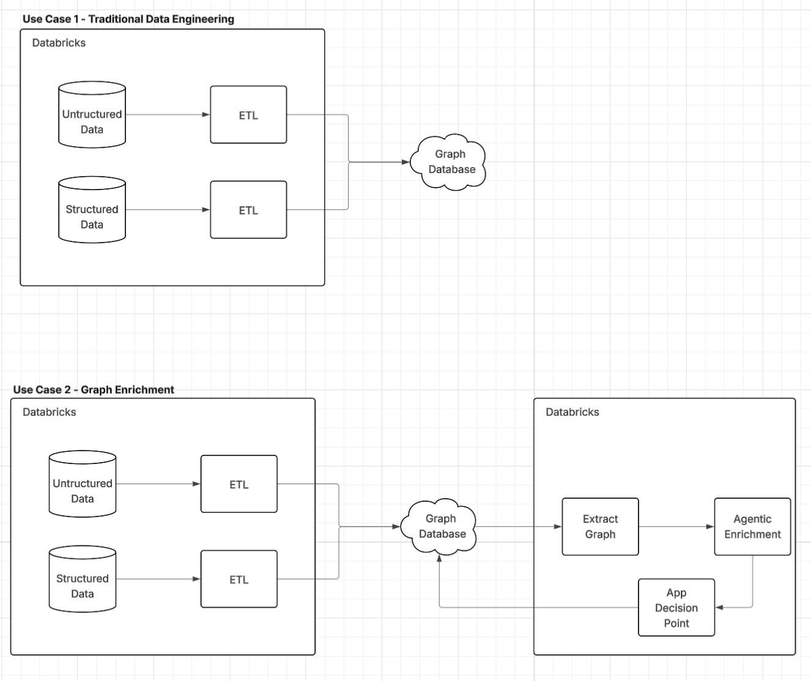

<style>
section {
  font-size: 22px;
}
h1 { font-size: 36px; }
h2 { font-size: 28px; }
code { font-size: 18px; }
table { font-size: 20px; }
</style>

# Agent-Augmented Knowledge Graphs
## Bridging Structured and Unstructured Data

---

## The Problem: Facts vs Intent

**Structured data captures what customers *have*, not what they *want*.**

A retail investment graph knows:
- Customer C0001 holds 50 shares of TCOR at $142.50
- The position sits in an account at First National Trust
- TCOR is TechCore Solutions in the technology sector

What the graph *doesn't yet capture*:

> Which customers want renewable energy exposure but don't have it?

The graph *could* answer this — but the intent data hasn't been extracted and connected yet.

---

## The Gap: James Anderson

James's **portfolio** (structured data):
- TCOR, SMTC, MOBD — all technology stocks
- Zero renewable energy holdings

James's **profile document** (unstructured data):

> "James is particularly interested in emerging technologies and has expressed interest in expanding his portfolio to include **renewable energy stocks**."

**The insight exists. It's just not connected to the graph.**

---


---

## The Solution: Agent-Augmented Enrichment


**The loop:** Extract graph → Analyze with agents → Enrich graph → Repeat

---



---

## What Agents Discover

| Gap Type | Example |
|----------|---------|
| **Interest-holding mismatch** | Wants renewable energy, holds only tech |
| **Risk profile discrepancy** | Database says "aggressive", profile says "careful" |
| **Data quality gap** | Job change in notes, not in structured fields |

**Result:** New relationships like `(:Customer)-[:INTERESTED_IN]->(:Sector)`

These become first-class graph data for queries and algorithms.

---

## Workshop Flow

```
┌────────────────────────────────────────────────────────────────────┐
│  Lab 1: Upload Data       →  CSV + HTML to Unity Catalog           │
│  Lab 2: Import to Neo4j   →  Build the knowledge graph             │
│  Lab 4: Export to Delta   →  Enable SQL-based agents               │
│  Lab 5: Create Agents     →  Genie (structured) + Knowledge (docs) │
│  Lab 6: Multi-Agent       →  Combine agents into unified system    │
│  Lab 7: Augmentation      →  AI suggests graph enrichments         │
└────────────────────────────────────────────────────────────────────┘
```

**Goal:** Close the loop between documents and graph structure.

---

## What is a Graph Database?

A **graph database** stores data as entities and their connections, rather than rows and columns.

**Why graphs?**
- Relationships are first-class citizens, not foreign key lookups
- Traversing connections is fast regardless of data size
- Schema flexibility — add new node types and relationships without migrations
- Natural fit for connected data: networks, hierarchies, recommendations

**Neo4j** is the leading native graph database, optimized for traversing relationships.

---

## Nodes

**Nodes** represent entities — the things in your data.

**Labels** categorize nodes (like table names in SQL):
```
(:Customer)    (:Account)    (:Stock)    (:Sector)
```

A node can have multiple labels: `(:Person:Employee:Manager)`

**Properties** store data as key-value pairs:
```
(:Customer {
    customer_id: "C0001",
    name: "James Anderson",
    risk_tolerance: "moderate"
})
```

Properties can be strings, numbers, booleans, dates, or arrays.

---

## Relationships

**Relationships** connect nodes — they always have a direction and a type.

**Type** describes how nodes are connected:
```
(:Customer)-[:HAS_ACCOUNT]->(:Account)
(:Account)-[:HAS_POSITION]->(:Stock)
(:Stock)-[:IN_SECTOR]->(:Sector)
```

**Properties** can also be stored on relationships:
```
[:HAS_POSITION {
    shares: 50,
    cost_basis: 142.50,
    purchase_date: date("2024-03-15")
}]
```

**Pattern notation:** `(node)-[relationship]->(node)` — reads like ASCII art of the graph.

---

## Cypher: The Graph Query Language

**Cypher** is Neo4j's declarative query language — like SQL for graphs.

```cypher
MATCH (c:Customer)
RETURN c
```

**Core clauses:**
- `MATCH` — find patterns in the graph
- `WHERE` — filter results
- `RETURN` — specify what to return
- `CREATE` — create nodes and relationships
- `SET` — update properties
- `DELETE` — remove nodes and relationships

**Pattern matching** is the core concept — you draw the shape of data you want.

---

## Cypher: Label Matching

Find all nodes with a specific **label**:

```cypher
MATCH (c:Customer)
RETURN c
```

Find all stocks:
```cypher
MATCH (s:Stock)
RETURN s.ticker, s.company_name
```

Count nodes by label:
```cypher
MATCH (a:Account)
RETURN count(a) AS total_accounts
```

Labels act like table names — they define what type of entity you're looking for.

---

## Cypher: Property Filtering

Filter nodes using the `WHERE` clause:

```cypher
MATCH (c:Customer)
WHERE c.risk_tolerance = "aggressive"
RETURN c.name
```

Inline property matching (shorthand):
```cypher
MATCH (c:Customer {risk_tolerance: "aggressive"})
RETURN c.name
```

Multiple conditions:
```cypher
MATCH (s:Stock)
WHERE s.sector = "Technology" AND s.price > 100
RETURN s.ticker, s.price
```

Common operators: `=`, `<>`, `<`, `>`, `CONTAINS`, `STARTS WITH`, `IN`

---

## Cypher: Single Relationship

Traverse one relationship using the arrow pattern:

```cypher
MATCH (c:Customer)-[:HAS_ACCOUNT]->(a:Account)
RETURN c.name, a.account_id
```

**What it matches:**
```
(Customer)--[:HAS_ACCOUNT]-->(Account)
```

**What it returns:** Every customer-account pair where the customer has that account.

| c.name | a.account_id |
|--------|--------------|
| James Anderson | A001 |
| Sarah Chen | A002 |

---

## Cypher: Chaining Relationships

Chain multiple relationships to traverse deeper:

```cypher
MATCH (c:Customer)-[:HAS_ACCOUNT]->(a:Account)-[:HAS_POSITION]->(s:Stock)
WHERE c.name = "James Anderson"
RETURN s.ticker, s.company_name
```

**What it matches:**
```
(Customer)--[:HAS_ACCOUNT]-->(Account)--[:HAS_POSITION]-->(Stock)
```

**What it returns:** All stocks held by James Anderson across all his accounts.

| s.ticker | s.company_name |
|----------|----------------|
| TCOR | TechCore Solutions |
| SMTC | SmartTech Corp |

---

## Cypher: Relationship Property Filtering

Assign a variable to a relationship to access its properties:

```cypher
MATCH (c:Customer)-[:HAS_ACCOUNT]->(a:Account)-[p:HAS_POSITION]->(s:Stock)
WHERE p.shares > 100
RETURN c.name, s.ticker, p.shares
```

**What it matches:**
```
(Customer)--[:HAS_ACCOUNT]-->(Account)--[p:HAS_POSITION]-->(Stock)
                                         where p.shares > 100
```

**What it returns:** Only positions where the customer holds more than 100 shares.

| c.name | s.ticker | p.shares |
|--------|----------|----------|
| Sarah Chen | ECOP | 150 |
| James Anderson | MOBD | 200 |

Use `[p:HAS_POSITION]` to bind the relationship to variable `p`, then filter with `WHERE p.property`.

---

## Cypher: Variable-Length Paths

Match paths of varying length with `*min..max`:

```cypher
MATCH (c:Customer)-[*1..3]->(s:Sector)
WHERE c.name = "James Anderson"
RETURN c.name, s.name
```

**What it matches:** Any path from Customer to Sector that is 1, 2, or 3 hops.
```
(Customer)--[*1..3]-->(Sector)
```

**Possible paths found:**
- `(Customer)-[:INTERESTED_IN]->(Sector)` — 1 hop
- `(Customer)-[:HAS_ACCOUNT]->()-[:HAS_POSITION]->()-[:IN_SECTOR]->(Sector)` — 3 hops

Variable-length paths are powerful for discovering indirect connections.

---

## Cypher: Aggregation with COUNT

Count results using the `count()` function:

```cypher
MATCH (c:Customer)-[:HAS_ACCOUNT]->(a:Account)
RETURN c.name, count(a) AS num_accounts
```

**What it returns:** The number of accounts each customer has.

| c.name | num_accounts |
|--------|--------------|
| James Anderson | 2 |
| Sarah Chen | 1 |

Count all matches:
```cypher
MATCH (s:Stock)
RETURN count(s) AS total_stocks
```

---

## Cypher: Aggregation with SUM

Sum numeric values using the `sum()` function:

```cypher
MATCH (c:Customer)-[:HAS_ACCOUNT]->(a:Account)-[p:HAS_POSITION]->(s:Stock)
WHERE c.name = "James Anderson"
RETURN sum(p.shares) AS total_shares, sum(p.shares * s.price) AS portfolio_value
```

**What it returns:** Total shares and portfolio value across all positions.

| total_shares | portfolio_value |
|--------------|-----------------|
| 350 | 52,450.00 |

Other aggregation functions: `avg()`, `min()`, `max()`, `collect()`

---

## Cypher: Grouping with Aggregation

Combine grouping columns with aggregation:

```cypher
MATCH (c:Customer)-[:HAS_ACCOUNT]->(a)-[p:HAS_POSITION]->(s:Stock)-[:IN_SECTOR]->(sec:Sector)
RETURN c.name, sec.name AS sector, sum(p.shares) AS shares_in_sector
```

**What it returns:** Shares per sector for each customer.

| c.name | sector | shares_in_sector |
|--------|--------|------------------|
| James Anderson | Technology | 300 |
| James Anderson | Healthcare | 50 |
| Sarah Chen | Renewable Energy | 150 |

Non-aggregated columns in RETURN become grouping columns (like SQL GROUP BY).

---

## Cypher: Pipelining with WITH

`WITH` passes results from one query part to the next — like a pipe:

```cypher
MATCH (c:Customer)-[:HAS_ACCOUNT]->(a:Account)
WITH c, count(a) AS num_accounts
RETURN c.name, num_accounts
```

**How it works:**
1. `MATCH` finds all customer-account pairs
2. `WITH` groups by customer and counts accounts
3. `RETURN` outputs the final results

Think of `WITH` as creating an intermediate result set to work with.

---

## Cypher: Chaining Operations with WITH

Chain multiple operations together:

```cypher
MATCH (c:Customer)-[:HAS_ACCOUNT]->(a:Account)-[p:HAS_POSITION]->(s:Stock)
WITH c, sum(p.shares * s.price) AS portfolio_value
WITH c, portfolio_value,
     CASE WHEN portfolio_value > 50000 THEN "high" ELSE "standard" END AS tier
RETURN c.name, portfolio_value, tier
```

**What it does:**
1. Calculate portfolio value per customer
2. Add a tier classification based on value
3. Return the enriched result

Each `WITH` transforms the data for the next stage.

---

## Cypher: Filter After Aggregation

Use `WITH` to filter results after aggregation:

```cypher
MATCH (c:Customer)-[:HAS_ACCOUNT]->(a:Account)-[p:HAS_POSITION]->(s:Stock)
WITH c, count(DISTINCT s) AS num_stocks
WHERE num_stocks >= 3
RETURN c.name, num_stocks
```

**What it returns:** Only customers holding 3 or more different stocks.

| c.name | num_stocks |
|--------|------------|
| James Anderson | 4 |

**Why WITH?** You can't use `WHERE` on aggregated values directly — `WITH` creates an intermediate result you can filter.

---

## Common Cypher Operations

| Operation | Cypher |
|-----------|--------|
| **Create node** | `CREATE (c:Customer {name: "Jane"})` |
| **Create relationship** | `MATCH (c:Customer), (s:Sector) CREATE (c)-[:INTERESTED_IN]->(s)` |
| **Find patterns** | `MATCH (c)-[:HAS_ACCOUNT]->(a) RETURN c, a` |
| **Filter results** | `WHERE c.name CONTAINS "James"` |
| **Aggregate** | `RETURN count(c), sum(p.shares)` |
| **Update** | `SET c.status = "active"` |
| **Delete** | `DELETE c` or `DETACH DELETE c` |

**Key insight:** You query by describing the pattern, not by joining tables.
